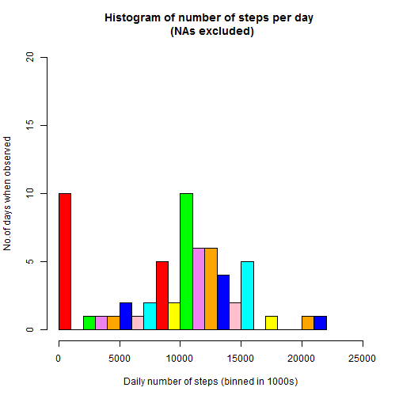
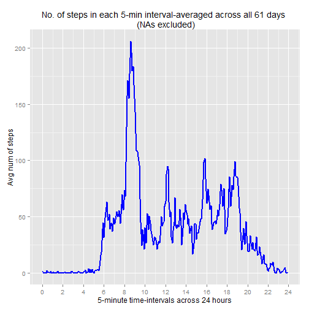
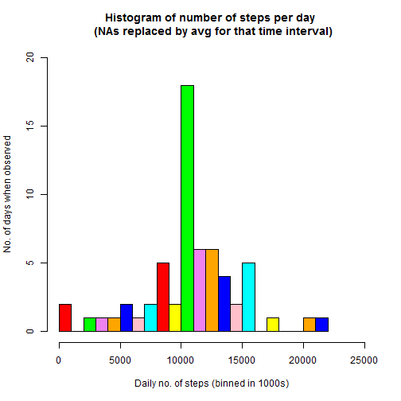
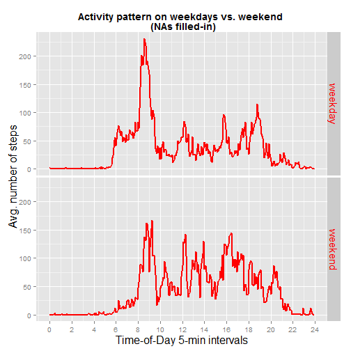

Assignment 1 (Data Science:Reproducible Research)
=================================================

##  Analysis of data from a personal activity monitoring device  
### Introduction & Background
This assignment makes use of data from a personal activity monitoring device. This device collects data at 5 minute intervals throughout the day. The data consists of two months of data from an anonymous individual collected during the months of October and November, 2012 and include the number of steps taken in 5 minute intervals each day.

The data for this assignment has been downloaded from the following course web site:
https://d396qusza40orc.cloudfront.net/repdata%2Fdata%2Factivity.zip
It has been already unzipped and the resulting "activity.csv"" file is stored in the current working directory. 

This PA1.rmd file is also located in the same directory as where the "activity.csv" file is. 

The variables included in this dataset are:

1.steps: Number of steps taking in a 5-minute interval (missing values are coded as NA)

2.date: The date on which the measurement was taken in YYYY-MM-DD format

3.interval: Identifier for the 5-minute interval in which measurement was taken

The dataset is stored in a comma-separated-value (CSV) file and there are a total of 17,568 observations in this dataset.

### 1. Loading & Pre-processing the data.

- Read in the csv dataset.
- Confirm the number of rows matches the expected 17,568 observations. 
- Confirm the structure is as specified in the assignment instructions.

```r
activity <- read.csv("activity.csv", header = TRUE,na.strings = "NA");

str(activity)
```

```
## 'data.frame':	17568 obs. of  3 variables:
##  $ steps   : int  NA NA NA NA NA NA NA NA NA NA ...
##  $ date    : Factor w/ 61 levels "2012-10-01","2012-10-02",..: 1 1 1 1 1 1 1 1 1 1 ...
##  $ interval: int  0 5 10 15 20 25 30 35 40 45 ...
```

```r
summary(activity)
```

```
##      steps                date          interval     
##  Min.   :  0.00   2012-10-01:  288   Min.   :   0.0  
##  1st Qu.:  0.00   2012-10-02:  288   1st Qu.: 588.8  
##  Median :  0.00   2012-10-03:  288   Median :1177.5  
##  Mean   : 37.38   2012-10-04:  288   Mean   :1177.5  
##  3rd Qu.: 12.00   2012-10-05:  288   3rd Qu.:1766.2  
##  Max.   :806.00   2012-10-06:  288   Max.   :2355.0  
##  NA's   :2304     (Other)   :15840
```

Load the R packages needed for the data analysis. 

```r
library(ggplot2);
library(lubridate);
library(scales);
library(dplyr);
library(knitr);
```

### 2. What is the mean total number of steps taken per day ?
As per instructions, for this part of the assignment, we will ignore missing values. i.e. when adding up the number of steps taken every day, if the value is unknown (NA) for a specific 5-minute interval, then we will remove those values from the calculation of mean and median.

**2.1 Calculate the  total number of steps taken per day.**

Use the dplyr package functions. The summarised data.frame "activityDailyTotalSteps" will now contain the total number of steps taken per day. There are 61 rows in this data.frame (one row for each day from 2012-10-01 to 2012-11-30).


```r
activityGrpByDate <- group_by(activity, date);
activityDailyTotalSteps <- summarize(activityGrpByDate, DailyStepsTotal = sum(steps,na.rm = TRUE));

str(activityDailyTotalSteps);
```

```
## Classes 'tbl_df', 'tbl' and 'data.frame':	61 obs. of  2 variables:
##  $ date           : Factor w/ 61 levels "2012-10-01","2012-10-02",..: 1 2 3 4 5 6 7 8 9 10 ...
##  $ DailyStepsTotal: int  0 126 11352 12116 13294 15420 11015 0 12811 9900 ...
##  - attr(*, "drop")= logi TRUE
```

```r
head(activityDailyTotalSteps);
```

```
## Source: local data frame [6 x 2]
## 
##         date DailyStepsTotal
## 1 2012-10-01               0
## 2 2012-10-02             126
## 3 2012-10-03           11352
## 4 2012-10-04           12116
## 5 2012-10-05           13294
## 6 2012-10-06           15420
```

```r
tail(activityDailyTotalSteps)
```

```
## Source: local data frame [6 x 2]
## 
##         date DailyStepsTotal
## 1 2012-11-25           11834
## 2 2012-11-26           11162
## 3 2012-11-27           13646
## 4 2012-11-28           10183
## 5 2012-11-29            7047
## 6 2012-11-30               0
```

**2.2 Make a histogram of the total number of steps taken each day.**

The histogram shows that there are 10 days when the number of steps walked is between 10,000 and 11,000 steps. 

Similarly, there are 10 days when the number of steps walked is under 1,000 steps.

And there are 5 days when the number of steps walked is between 8,000 and 9,000 steps. 


```r
colors <- c("red", "yellow", "green", "violet", "orange", "blue", "pink", "cyan") 

hist(activityDailyTotalSteps$DailyStepsTotal,
     breaks = 20, 
     main = "Histogram of number of steps per day \n (NAs excluded)",
     xlab = "Daily number of steps (binned in 1000s)",
     ylab = "No.of days when observed",
     xlim = c(0,25000),
     ylim = c(0,20),
     col = colors
     )
```

 

**2.3  Calculate and report the mean and median of the total number of steps taken per day.**

The summary() function provides the mean & median values of the total number of steps taken per day as follows:

**mean = 9354 steps**

**median = 10395 steps**


```r
summary(activityDailyTotalSteps)
```

```
##          date    DailyStepsTotal
##  2012-10-01: 1   Min.   :    0  
##  2012-10-02: 1   1st Qu.: 6778  
##  2012-10-03: 1   Median :10395  
##  2012-10-04: 1   Mean   : 9354  
##  2012-10-05: 1   3rd Qu.:12811  
##  2012-10-06: 1   Max.   :21194  
##  (Other)   :55
```

### 3. What is the average daily activity pattern?


As per the instructions in the assignment, the unknown values (NAs) are ignored (removed) before we apply the mean() function.

Use the dplyr package functions. 

The summarised data-frame "AvgStepsByInterval" will now contain the average number of steps taken per day within each of the 5-minute intervals, averaged across the 61 days . There are 288 rows in this data-frame (one row for each 5-minute time-interval. So there are 12 rows per hour and 12 x 24 = 288 rows for a 24-hour period. 


```r
activityGrpByInterval <- group_by(activity, interval);
AvgStepsByInterval <- summarize(activityGrpByInterval, AvgSteps = mean(steps,na.rm = TRUE));

str(AvgStepsByInterval);
```

```
## Classes 'tbl_df', 'tbl' and 'data.frame':	288 obs. of  2 variables:
##  $ interval: int  0 5 10 15 20 25 30 35 40 45 ...
##  $ AvgSteps: num  1.717 0.3396 0.1321 0.1509 0.0755 ...
##  - attr(*, "drop")= logi TRUE
```

```r
head(AvgStepsByInterval, 15);
```

```
## Source: local data frame [15 x 2]
## 
##    interval  AvgSteps
## 1         0 1.7169811
## 2         5 0.3396226
## 3        10 0.1320755
## 4        15 0.1509434
## 5        20 0.0754717
## 6        25 2.0943396
## 7        30 0.5283019
## 8        35 0.8679245
## 9        40 0.0000000
## 10       45 1.4716981
## 11       50 0.3018868
## 12       55 0.1320755
## 13      100 0.3207547
## 14      105 0.6792453
## 15      110 0.1509434
```

```r
tail(AvgStepsByInterval)
```

```
## Source: local data frame [6 x 2]
## 
##   interval  AvgSteps
## 1     2330 2.6037736
## 2     2335 4.6981132
## 3     2340 3.3018868
## 4     2345 0.6415094
## 5     2350 0.2264151
## 6     2355 1.0754717
```


Note that the value of the "interval" column is "100" in row 13. This is actually meant to be read as the 5-minute timeslot beginning at "1 hour past midnight" (and not the number 100). That's why the value of the interval appears to  "jumps" from 55 (in row 12) to 100 (in row 13).

Similarly, the last row of the data-frame has interval value of "2355". This is actually meant to be read as the 5-minute timeslot beginning at "23 hours and 55 mins past midnight" (and not the number 2355).

So we need to convert this numeric interval column into date format.


```r
## pad the interval values on the left with zeros and convert into 4-digit characters
AvgStepsByInterval$interval <- formatC(AvgStepsByInterval$interval, width=4, flag="0");

## insert a colon (:) to create a HH:MM format
AvgStepsByInterval$interval <- sub("([[:digit:]]{2,2})$", ":\\1", AvgStepsByInterval$interval);

head(AvgStepsByInterval);
```

```
## Source: local data frame [6 x 2]
## 
##   interval  AvgSteps
## 1    00:00 1.7169811
## 2    00:05 0.3396226
## 3    00:10 0.1320755
## 4    00:15 0.1509434
## 5    00:20 0.0754717
## 6    00:25 2.0943396
```

```r
## Add a prefix of a **DUMMY** date-string of "2015-05-01" to all rows so that 
## we can convert the char format into POSIXct format. Note in this case the actual value of the date itself does not matter.  
AvgStepsByInterval$POSIXctTimeSlot <- ymd_hm(paste("2015-05-01", AvgStepsByInterval$interval, sep = " "))

## Discard the date portion and convert the time portion into seconds and 
## then divide by 3600 to convert into hours 
AvgStepsByInterval$HrsSlot <- (as.numeric(AvgStepsByInterval$POSIXctTimeSlot - trunc(AvgStepsByInterval$POSIXctTimeSlot, "days")))/3600
```


```r
head(AvgStepsByInterval);
```

```
## Source: local data frame [6 x 4]
## 
##   interval  AvgSteps     POSIXctTimeSlot    HrsSlot
## 1    00:00 1.7169811 2015-05-01 00:00:00 0.00000000
## 2    00:05 0.3396226 2015-05-01 00:05:00 0.08333333
## 3    00:10 0.1320755 2015-05-01 00:10:00 0.16666667
## 4    00:15 0.1509434 2015-05-01 00:15:00 0.25000000
## 5    00:20 0.0754717 2015-05-01 00:20:00 0.33333333
## 6    00:25 2.0943396 2015-05-01 00:25:00 0.41666667
```

```r
tail(AvgStepsByInterval)
```

```
## Source: local data frame [6 x 4]
## 
##   interval  AvgSteps     POSIXctTimeSlot  HrsSlot
## 1    23:30 2.6037736 2015-05-01 23:30:00 23.50000
## 2    23:35 4.6981132 2015-05-01 23:35:00 23.58333
## 3    23:40 3.3018868 2015-05-01 23:40:00 23.66667
## 4    23:45 0.6415094 2015-05-01 23:45:00 23.75000
## 5    23:50 0.2264151 2015-05-01 23:50:00 23.83333
## 6    23:55 1.0754717 2015-05-01 23:55:00 23.91667
```

**3.1 Make a time series plot (i.e. type = "l") of the 5-minute interval (x-axis) and the average number of steps taken, averaged across all days (y-axis).**


```r
g1 <- ggplot(data=AvgStepsByInterval, aes(x=HrsSlot, y=AvgSteps, group = 1)) 
g1 <- g1 + geom_line(colour="blue", size=1.0)
g1 <- g1 + xlab("5-minute time-intervals across 24 hours") + ylab("Avg num of steps")
g1 <- g1 + ggtitle('No. of steps in each 5-min interval-averaged across all 61 days \n (NAs excluded)')
g1 <- g1 + scale_x_continuous(breaks=seq(0,24,2))
g1;
```

 


**3.2 Which 5-minute interval, on average across all the days in the dataset, contains the maximum number of steps?**

Use the dplyr package arrange() function to sort the data-frame in descending order of average steps. The first row will then give the answer.

**On average, during the 5-minute time interval of 8:35am, the maximum number of steps are walked (i.e. just over 206 steps)**
This is confirmed by the above time-series plot.


```r
arrange(AvgStepsByInterval, desc(AvgSteps))
```

```
## Source: local data frame [288 x 4]
## 
##    interval AvgSteps     POSIXctTimeSlot  HrsSlot
## 1     08:35 206.1698 2015-05-01 08:35:00 8.583333
## 2     08:40 195.9245 2015-05-01 08:40:00 8.666667
## 3     08:50 183.3962 2015-05-01 08:50:00 8.833333
## 4     08:45 179.5660 2015-05-01 08:45:00 8.750000
## 5     08:30 177.3019 2015-05-01 08:30:00 8.500000
## 6     08:20 171.1509 2015-05-01 08:20:00 8.333333
## 7     08:55 167.0189 2015-05-01 08:55:00 8.916667
## 8     08:15 157.5283 2015-05-01 08:15:00 8.250000
## 9     08:25 155.3962 2015-05-01 08:25:00 8.416667
## 10    09:00 143.4528 2015-05-01 09:00:00 9.000000
## ..      ...      ...                 ...      ...
```

### 4. Imputing missing values

**4.1 Calculate and report the total number of missing values in the dataset (i.e. the total number of rows with NAs)** 

```r
NumOfRowsWithMissingValues <- sum(!complete.cases(activity))
print(c("Number of Rows with missing values = ", NumOfRowsWithMissingValues))   
```

```
## [1] "Number of Rows with missing values = "
## [2] "2304"
```

```r
##2304 rows have NAs
```

**4.2 Devise a strategy for filling in all of the missing values in the dataset. The strategy does not need to be sophisticated. For example, you could use the mean/median for that day, or the mean for that 5-minute interval, etc.**

My chosen strategy to fill in the missing values in each row is by using the mean of that 5-minute interval (which was previously calculated in section 3 above and is stored in the "AvgStepsByInterval" data-frame).


```r
## Create temporary copy "activity2" of the "activity" dataframe. 
activity2 <- tbl_df(activity)
AvgStepsByInterval2 <- summarize(activityGrpByInterval, AvgSteps = mean(steps,na.rm = TRUE))

## Use the inner_join function from the dplyr package to create a new data-frame "JoinedDF". 
## Joining by: "interval" since that is the common variable between the two data-frames.
JoinedDF <- inner_join(activity2, AvgStepsByInterval2);   
```

```
## Joining by: "interval"
```

```r
## Delete the temporary data-frame ac
rm(activity2);

## Now the joined data-frame has an additional column called "AvgSteps" 
## which shows the average number of steps for that corresponding 5-minute time interval.
head(JoinedDF);
```

```
## Source: local data frame [6 x 4]
## 
##   steps       date interval  AvgSteps
## 1    NA 2012-10-01        0 1.7169811
## 2    NA 2012-10-01        5 0.3396226
## 3    NA 2012-10-01       10 0.1320755
## 4    NA 2012-10-01       15 0.1509434
## 5    NA 2012-10-01       20 0.0754717
## 6    NA 2012-10-01       25 2.0943396
```

```r
tail(JoinedDF);
```

```
## Source: local data frame [6 x 4]
## 
##   steps       date interval  AvgSteps
## 1    NA 2012-11-30     2330 2.6037736
## 2    NA 2012-11-30     2335 4.6981132
## 3    NA 2012-11-30     2340 3.3018868
## 4    NA 2012-11-30     2345 0.6415094
## 5    NA 2012-11-30     2350 0.2264151
## 6    NA 2012-11-30     2355 1.0754717
```

```r
## Now use the mutate function of the dplyr package to create a new column called "steps2" 
## and populate this new column as follows: 
##      If "steps"" for a particular 5-minute interval is unknown (NA), then 
##          "steps2" should be equal to the "AvgSteps" for that same 5-minute-interval
##      If "steps"" is known and already populated for a particular 5-minute interval, then 
##          "steps2" should have the same value as "steps"

JoinedDF <- JoinedDF %>% mutate(steps2 = ifelse(is.na(steps) , AvgSteps , steps ));

head(JoinedDF);
```

```
## Source: local data frame [6 x 5]
## 
##   steps       date interval  AvgSteps    steps2
## 1    NA 2012-10-01        0 1.7169811 1.7169811
## 2    NA 2012-10-01        5 0.3396226 0.3396226
## 3    NA 2012-10-01       10 0.1320755 0.1320755
## 4    NA 2012-10-01       15 0.1509434 0.1509434
## 5    NA 2012-10-01       20 0.0754717 0.0754717
## 6    NA 2012-10-01       25 2.0943396 2.0943396
```

**4.3 Create a new dataset that is equal to the original dataset but with the missing data filled in.**

Now re-create the "activity2" data-frame by selecting only the appropriate columns from the "JoinedDF" data-frame. This "activity2" data-frame is equal to the original "activity" dataset **but with the missing data filled in.**

Note the output of the head() and tail() commands below : there are **no more NA values.** 


```r
activity2 <- select(JoinedDF, steps = steps2, date = date, interval = interval)

str(activity2);
```

```
## Classes 'tbl_df', 'tbl' and 'data.frame':	17568 obs. of  3 variables:
##  $ steps   : num  1.717 0.3396 0.1321 0.1509 0.0755 ...
##  $ date    : Factor w/ 61 levels "2012-10-01","2012-10-02",..: 1 1 1 1 1 1 1 1 1 1 ...
##  $ interval: int  0 5 10 15 20 25 30 35 40 45 ...
```

```r
head(activity2);
```

```
## Source: local data frame [6 x 3]
## 
##       steps       date interval
## 1 1.7169811 2012-10-01        0
## 2 0.3396226 2012-10-01        5
## 3 0.1320755 2012-10-01       10
## 4 0.1509434 2012-10-01       15
## 5 0.0754717 2012-10-01       20
## 6 2.0943396 2012-10-01       25
```

```r
tail(activity2);
```

```
## Source: local data frame [6 x 3]
## 
##       steps       date interval
## 1 2.6037736 2012-11-30     2330
## 2 4.6981132 2012-11-30     2335
## 3 3.3018868 2012-11-30     2340
## 4 0.6415094 2012-11-30     2345
## 5 0.2264151 2012-11-30     2350
## 6 1.0754717 2012-11-30     2355
```

**4.4.1. Make a histogram of the total number of steps taken each day.** 


```r
activity2GrpByDate <- group_by(activity2, date);
activity2DailyTotalSteps <- summarize(activity2GrpByDate, DailyStepsTotal = sum(steps));

hist(activity2DailyTotalSteps$DailyStepsTotal,
     breaks = 20, 
     main = "Histogram of number of steps per day \n (NAs replaced by avg for that time interval)",
     xlab = "Daily no. of steps (binned in 1000s)",
     ylab = "No. of days when observed",
     xlim = c(0,25000),
     ylim = c(0,20),
     col = colors
     )
```

 

**4.4.2. Calculate and report the mean and median total number of steps taken per day.** 

The summary() function provides the mean & median values of the total number of steps taken per day as follows:

**mean = 10766 steps (after NAs replaced by avg for that time interval)**

**median = 10765 steps (after NAs replaced by avg for that time interval)**


```r
summary(activity2DailyTotalSteps)
```

```
##          date    DailyStepsTotal
##  2012-10-01: 1   Min.   :   41  
##  2012-10-02: 1   1st Qu.: 9819  
##  2012-10-03: 1   Median :10766  
##  2012-10-04: 1   Mean   :10766  
##  2012-10-05: 1   3rd Qu.:12811  
##  2012-10-06: 1   Max.   :21194  
##  (Other)   :55
```


**4.4.3. Do these values differ from the estimates from the first part of the assignment?**

Yes, after the NAs are replaced by average values for that time interval, the mean and median values have increased as follows: 

**mean : increased** from 9354 steps to 10766 steps

**median : increased** from 10395 steps to 10765 steps


**4.4.4. What is the impact of imputing missing data on the estimates of the total daily number of steps?**

Use the dplyr package functions. The summarised data.frame "activity2DailyTotalSteps" will now contain the total number of steps taken per day. There are 61 rows in this data.frame (one row for each day from 2012-10-01 to 2012-11-30).

**The impact of imputing missing data is that the values of the total daily number of steps has increased.**


```r
activity2GrpByDate <- group_by(activity2, date);
activity2DailyTotalSteps <- summarize(activity2GrpByDate, DailyStepsTotal = sum(steps,na.rm = TRUE));

str(activity2DailyTotalSteps);
```

```
## Classes 'tbl_df', 'tbl' and 'data.frame':	61 obs. of  2 variables:
##  $ date           : Factor w/ 61 levels "2012-10-01","2012-10-02",..: 1 2 3 4 5 6 7 8 9 10 ...
##  $ DailyStepsTotal: num  10766 126 11352 12116 13294 ...
##  - attr(*, "drop")= logi TRUE
```

```r
head(activity2DailyTotalSteps);
```

```
## Source: local data frame [6 x 2]
## 
##         date DailyStepsTotal
## 1 2012-10-01        10766.19
## 2 2012-10-02          126.00
## 3 2012-10-03        11352.00
## 4 2012-10-04        12116.00
## 5 2012-10-05        13294.00
## 6 2012-10-06        15420.00
```

```r
tail(activity2DailyTotalSteps);
```

```
## Source: local data frame [6 x 2]
## 
##         date DailyStepsTotal
## 1 2012-11-25        11834.00
## 2 2012-11-26        11162.00
## 3 2012-11-27        13646.00
## 4 2012-11-28        10183.00
## 5 2012-11-29         7047.00
## 6 2012-11-30        10766.19
```


### 5. Are there differences in activity patterns between weekdays and weekends? Use the dataset with the filled-in missing values for this part.

**5.1 Create a new factor variable in the dataset with two levels - "weekday" and "weekend" indicating whether a given date is a weekday or weekend day.**


```r
activity2 <- activity2 %>% mutate(WeekendOrNot = ifelse( wday(date)  %in% c(1, 7) , "weekend", "weekday" ));
activity2$WeekendOrNot <- as.factor(activity2$WeekendOrNot);

str(activity2);
```

```
## Classes 'tbl_df', 'tbl' and 'data.frame':	17568 obs. of  4 variables:
##  $ steps       : num  1.717 0.3396 0.1321 0.1509 0.0755 ...
##  $ date        : Factor w/ 61 levels "2012-10-01","2012-10-02",..: 1 1 1 1 1 1 1 1 1 1 ...
##  $ interval    : int  0 5 10 15 20 25 30 35 40 45 ...
##  $ WeekendOrNot: Factor w/ 2 levels "weekday","weekend": 1 1 1 1 1 1 1 1 1 1 ...
```

```r
head(activity2);
```

```
## Source: local data frame [6 x 4]
## 
##       steps       date interval WeekendOrNot
## 1 1.7169811 2012-10-01        0      weekday
## 2 0.3396226 2012-10-01        5      weekday
## 3 0.1320755 2012-10-01       10      weekday
## 4 0.1509434 2012-10-01       15      weekday
## 5 0.0754717 2012-10-01       20      weekday
## 6 2.0943396 2012-10-01       25      weekday
```

```r
tail(activity2);
```

```
## Source: local data frame [6 x 4]
## 
##       steps       date interval WeekendOrNot
## 1 2.6037736 2012-11-30     2330      weekday
## 2 4.6981132 2012-11-30     2335      weekday
## 3 3.3018868 2012-11-30     2340      weekday
## 4 0.6415094 2012-11-30     2345      weekday
## 5 0.2264151 2012-11-30     2350      weekday
## 6 1.0754717 2012-11-30     2355      weekday
```

**5.2 Make a panel plot containing a time series plot (i.e. type = "l") of the 5-minute interval (x-axis) and the average number of steps taken, averaged across all weekday days or weekend days (y-axis).** 


```r
## Create from "activity2" data-frame two separate data-frames: 
##  one each for weekend and for weekday observations.

weekdayActivity <- filter(activity2, WeekendOrNot == "weekday")
weekendActivity <- filter(activity2, WeekendOrNot == "weekend")

## Group-By & Summarise the weekday data to calculate the average num of steps 
## per 5-min time-slot across all weekdays (Mon to Fri)
weekdayGrpByInterval <- group_by(weekdayActivity, interval)
weekdayAvgStepsByInterval <- summarize(weekdayGrpByInterval, AvgSteps = mean(steps))
weekdayAvgStepsByInterval$WeekendOrNot <- rep(c("weekday"),nrow(weekdayAvgStepsByInterval) )

## Group-By & Summarise the weekend data to calculate the average num of steps 
## per 5-min time-slot across all weekend days (Sat & Sun)
weekendGrpByInterval <- group_by(weekendActivity, interval)
weekendAvgStepsByInterval <- summarize(weekendGrpByInterval, AvgSteps = mean(steps))
weekendAvgStepsByInterval$WeekendOrNot <- rep(c("weekend"),nrow(weekendAvgStepsByInterval) )

## Combine the two dataframes for weekdays and weekend activity together so they 
## can be plotted as 2 facets of the same plot. 
## Also need to convert "WeekendOrNot" column from CHAR to FACTOR.

AllDaysAvgStepsByInterval <- rbind(weekdayAvgStepsByInterval,weekendAvgStepsByInterval )
AllDaysAvgStepsByInterval$WeekendOrNot <- as.factor(AllDaysAvgStepsByInterval$WeekendOrNot)

## pad the interval values on the left with zeros and convert into 4-digit characters
AllDaysAvgStepsByInterval$interval <- formatC(AllDaysAvgStepsByInterval$interval, width=4, flag="0") 

## insert a colon (:) to create a HH:MM format
AllDaysAvgStepsByInterval$interval <- sub("([[:digit:]]{2,2})$", ":\\1", AllDaysAvgStepsByInterval$interval) 

## add a new column which will have a prefix of a **DUMMY** date-string of "2015-04-01" 
## to all rows so that we can convert the char format into POSIXct format.
AllDaysAvgStepsByInterval$POSIXctTimeSlot <- ymd_hm(paste("2015-04-01", AllDaysAvgStepsByInterval$interval, sep = " "))

## Discard the date portion and convert the time portion into seconds and 
## then divide by 3600 to convert into hours 
AllDaysAvgStepsByInterval$HrsSlot <- (as.numeric(AllDaysAvgStepsByInterval$POSIXctTimeSlot - trunc(AllDaysAvgStepsByInterval$POSIXctTimeSlot, "days")))/3600
```

Use ggplot to plot a panel plot of with 2 facets (for weekend vs weekday)


```r
g3 <- ggplot(data=AllDaysAvgStepsByInterval, aes(x=HrsSlot, y=AvgSteps, group = 1)) + geom_line(colour="red", size=1.0)
g3 <- g3 + ggtitle('Activity pattern on weekdays vs. weekend \n (NAs filled-in)')
g3 <- g3 + xlab("Time-of-Day 5-min intervals") + ylab("Avg. number of steps")
g3 <- g3 + scale_x_continuous(breaks=seq(0,24,2))
g3 <- g3 + theme(plot.title = element_text(lineheight=.8, face="bold"))
g3 <- g3 + facet_grid(WeekendOrNot ~ .)
g3 <- g3 + theme(strip.text.y = element_text(size = 15, colour = "red", angle = -90))
g3 <- g3 + theme(axis.title.y = element_text(size = rel(1.3), angle = 90))
g3 <- g3 + theme(axis.title.x = element_text(size = rel(1.3), angle = 0))
g3
```

 

**Based on this panel plot, we can infer that, overall, more steps are walked on weekdays compared to weekends.**

###     Assignment 1 Completed (Data Science: Reproducible Research Course) 
